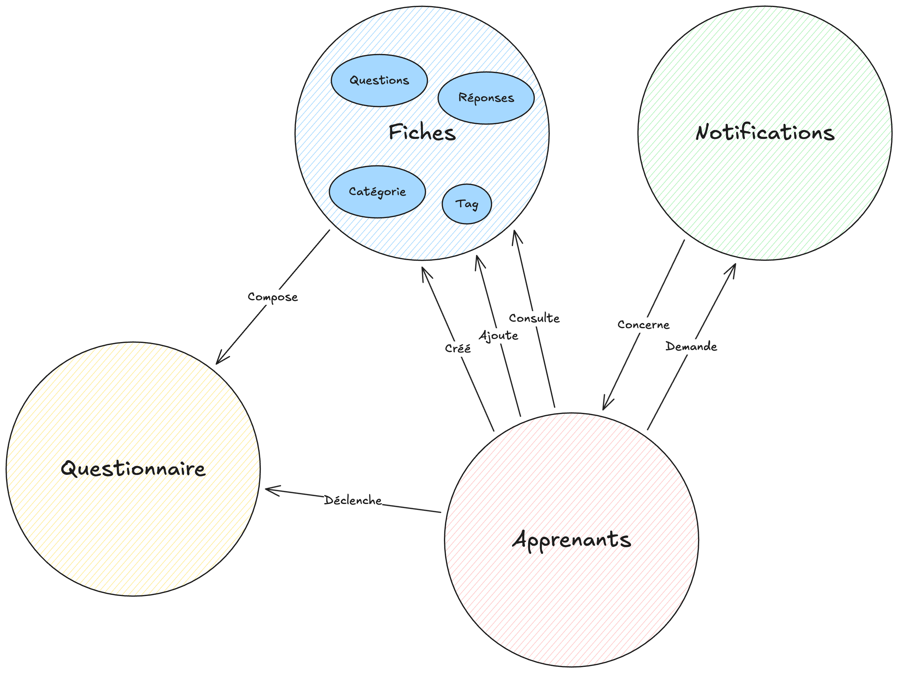
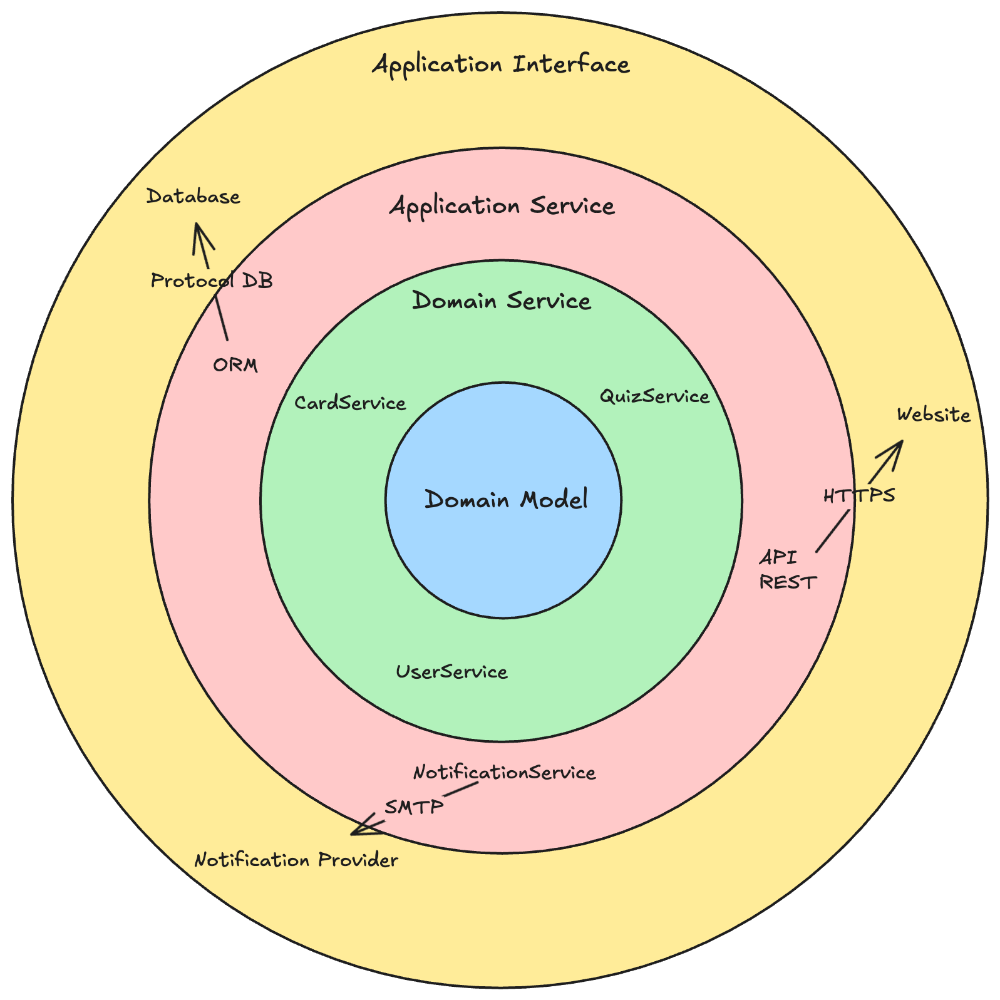

# Application de Flashcards - Système Leitner

Application backend pour la gestion de flashcards basée sur le système de Leitner avec répétition espacée et auto-évaluation.

## 📋 Table des matières

- [Architecture](#architecture)
- [Schéma DDD (Domain-Driven Design)](#schéma-ddd-domain-driven-design)
- [Schéma d'Architecture en Couches](#schéma-darchitecture-en-couches)
- [Structure du Projet](#structure-du-projet)
- [Endpoints API](#endpoints-api)
- [Installation](#installation)
- [Tests](#tests)

## 🏗️ Architecture

Cette application utilise une **architecture hexagonale** (Ports & Adapters) combinée avec les principes du **Domain-Driven Design (DDD)**.

### Principes

- **Séparation des responsabilités** : Chaque couche a une responsabilité claire
- **Inversion de dépendance** : Le domaine ne dépend pas de l'infrastructure
- **Testabilité** : Chaque couche peut être testée indépendamment
- **Maintenabilité** : Code organisé et facile à faire évoluer

## 📐 Schéma DDD (Domain-Driven Design)



## 🔄 Schéma d'Architecture en Couches



### Règles de dépendance

- ✅ **Interface Layer** → Application Layer → Domain Layer
- ✅ **Infrastructure Layer** → Domain Layer (implémente les ports)
- ❌ **Domain Layer** ne dépend JAMAIS de l'infrastructure
- ❌ **Domain Layer** ne dépend JAMAIS de l'interface

## 📁 Structure du Projet

```
app/
├── application/              # Application Layer (Use Cases)
│   └── services/
│       ├── card.service.ts
│       └── quiz.service.ts
│
├── controllers/              # Interface Layer (HTTP Controllers)
│   ├── auth.controller.ts
│   ├── cards.controller.ts
│   └── quiz.controller.ts
│
├── domain/                   # Domain Layer (Business Logic)
│   ├── entities/            # Entités métier
│   │   ├── card.ts
│   │   └── user.ts
│   ├── value_objects/        # Objets valeur
│   │   ├── card_id.value_object.ts
│   │   └── category.value_object.ts
│   ├── services/             # Services du domaine
│   │   ├── leitner_scheduler.service.ts
│   │   └── quiz_daily_limit.service.ts
│   └── ports/                # Interfaces (Ports)
│       └── card_repository.ts
│
├── infrastructure/           # Infrastructure Layer (Adapters)
│   └── adapters/
│       └── repositories/
│           └── card_repository.ts
│
└── middleware/              # Middleware HTTP
    ├── auth_middleware.ts
    └── container_bindings_middleware.ts
```

## 🔌 Endpoints API

### Authentification

- **POST** `/auth/login` - Connexion utilisateur (authentification fictive)

### Cartes (authentifié)

- **GET** `/cards` - Liste des cartes de l'utilisateur
  - Query params: `?tags=tag1,tag2` (optionnel)
- **POST** `/cards` - Création d'une nouvelle carte
  - Body: `{ question, answer, tag? }`

### Quiz (authentifié)

- **GET** `/cards/quizz` - Récupère les cartes disponibles pour le quiz
  - Query params: `?date=YYYY-MM-DD` (optionnel)
  - Limite: 1 quiz par jour par utilisateur
- **PATCH** `/cards/:cardId/answer` - Répondre à une carte
  - Body: `{ isValid: boolean, forceValidation?: boolean }`

## 🚀 Installation

```bash
# Installer les dépendances
npm install

# Lancer en mode développement
npm run dev

# Lancer les tests
npm test

# Vérifier le code
npm run lint
npm run typecheck
```

## 🧪 Tests

### Exécuter les tests

```bash
npm test
```

## 📊 Système Leitner

Le système implémente 7 catégories avec des intervalles de révision doublés :

| Catégorie | Intervalle (jours) |
| --------- | ------------------ |
| 1         | 1                  |
| 2         | 2                  |
| 3         | 4                  |
| 4         | 8                  |
| 5         | 16                 |
| 6         | 32                 |
| 7         | 64                 |

### Règles métier

- ✅ **Bonne réponse** : La carte passe à la catégorie supérieure
- ❌ **Mauvaise réponse** : La carte revient en catégorie 1
- 🎯 **Catégorie 7 → DONE** : Après 7 bonnes réponses consécutives, la carte est marquée comme terminée
- 📅 **Date de révision** : Calculée automatiquement selon la catégorie
- 🚫 **Limite quotidienne** : Un seul quiz par jour par utilisateur

## 🔐 Authentification

L'application utilise une **authentification fictive** pour simplifier le développement :

- Le token est simplement le nom d'utilisateur
- Format: `Bearer {username}`
- Pas de vérification réelle de mot de passe

## 📝 Technologies

- **Framework** : AdonisJS 6
- **Language** : TypeScript
- **Tests** : Japa
- **Architecture** : Hexagonale (Ports & Adapters) + DDD
